<!-- _class: title -->
<!-- _paginate: false -->
<!-- _footer: "" -->

# GridSmith

## Building a physical product in the age of AI

**A lunch & learn about ideas, iteration, and making real things**

<!--
Open with the finished product in your hands.
"GridSmith is a modular, 3D-printed terrain system for tabletop games."
Frame this as the story of one frustration turning into CAD, manufacturing,
software, and a website. (~1 min)
-->

---

<!-- _class: deck-process -->

# This deck was built the same way

Human
<strong>Effort + intent</strong>

The story, the judgment, the taste, and the decision to make it.

AI
<strong>System + syntax</strong>

Structure, iteration, Markdown, CSS, and the mechanics that made it real.

<strong>ChatGPT</strong> for collaboration · <strong>Marp</strong> for slides · <strong>VS Code</strong> for the live editing loop

<!--
Briefly reveal how the presentation itself was made:
- You supplied the story, goals, feedback, and every meaningful decision.
- ChatGPT helped develop the structure, wording, and implementation.
- Marp turned Markdown and CSS into a presentation.
- VS Code provided the editing and immediate preview loop.

This is a small, recursive example of the talk's central idea. The AI did not
decide that this presentation should exist or what your story meant. It lowered
the friction between your intent and a working artifact. (~1 min)
-->

---

<!-- _class: sample-slide -->

# Before GridSmith, I printed hundreds of tiles

I knew these systems as a user long before I tried to become a designer.

<strong>Pass the samples around</strong>
Feel the thickness. Notice where the walls sit. Look at how the pieces define the layout.

<!--
Start passing the older tile-system samples around now. Let them continue
moving through the room during the next slide.

Explain that you genuinely liked and used these systems. This is not a teardown
of somebody else's work; it is the perspective of a heavy user who learned
where the tradeoffs lived by printing hundreds of pieces.

Ask the audience to notice three physical details:
- How thick and heavy the base is
- How a wall occupies part of the floor tile
- How the tile shapes constrain what can be assembled

The samples make the problem tangible before you introduce your answer. (~2 min)
-->

---

# The geometry made you pay three times

<strong>Too much plastic</strong>Excessive thickness became filament locked inside every tile.

<strong>Too much waiting</strong>Every unnecessary layer added print time—then multiplied across a set.

<strong>Too little floor</strong>Walls consumed half a tile, shrinking the playable space you just printed.

<strong>Too few layouts</strong>The system struggled with narrow hallways and other useful configurations.

Plastic. Time. Playable space. Flexibility.

<!--
Use the samples as evidence while you walk through the four constraints.

Excessive thickness:
- Material was being spent where it did not improve the play experience.
- A small amount per tile becomes substantial across hundreds of tiles.

Print time:
- Thickness means layers, and layers mean time.
- Building a usable room or dungeon required committing the printer for a long
  time before play could begin.

Floor efficiency:
- When the wall shares the floor tile, it consumes a meaningful part of the
  playable square.
- You pay to print floor area that cannot really be used.

Layout flexibility:
- Wall and floor geometry are coupled.
- Narrow hallways and other common layouts become awkward or impossible.

The insight: these were not four unrelated annoyances. They all came from the
underlying geometry of the system. (~2.5 min)
-->

---

<!-- _class: photo -->

# Meet GridSmith

  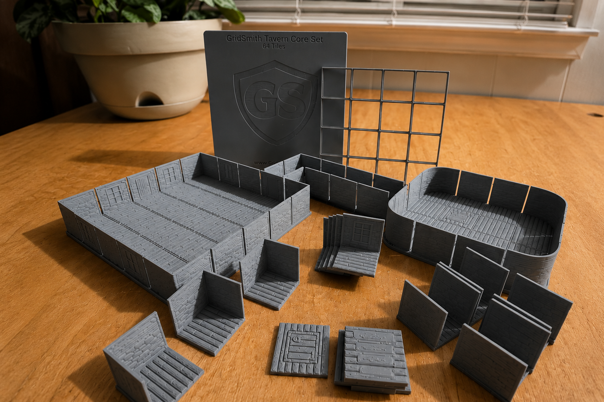

<!--
Show the destination before the journey. Point out the base grid, tiles,
walls, props, and trays. Drop a tile into the grid if you brought one. (~1 min)
-->

---

<!-- _class: statement -->

# What if terrain could use less—and do more?

## Less filament. Less waiting. More usable floor. More ways to build.

<!--
This is the product-design challenge distilled from the samples.

GridSmith would need to change the underlying geometry, not merely make a
prettier version of the same tile. Refer back to this promise when you discuss
thin parts, separate walls, print time, and hallway layouts. (~1 min)
-->

---

# So I asked the dangerous question

How hard would it be to create my own?

A reasonable question with a wildly unreasonable answer.

<!--
You had enough experience to see the problems, but no background as a CAD
designer or manufacturing engineer.

That gap is what made this both a product idea and a perfect AI experiment:
could you use AI to cross into an unfamiliar discipline and make a real,
physical system of your own? (~1 min)
-->

---

<!-- _class: statement dark -->

# I wanted to test AI on something real

## Not a toy prompt—a physical system with code, constraints, failures, and consequences.

<!--
GridSmith was deliberately an experiment in using AI more robustly:
- Could it stay useful across a long-running, multi-disciplinary project?
- Could it help move between product thinking, CAD, manufacturing, writing,
  branding, and web development?
- Could the collaboration survive contact with the physical world?

Position AI as a persistent collaborator, not an answer machine. It accelerated
exploration, but you still chose the direction and owned every result. (~1.5 min)
-->

---

# OpenSCAD became our shared language

  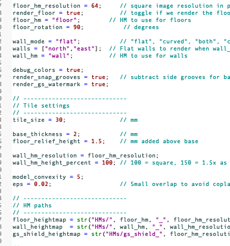

  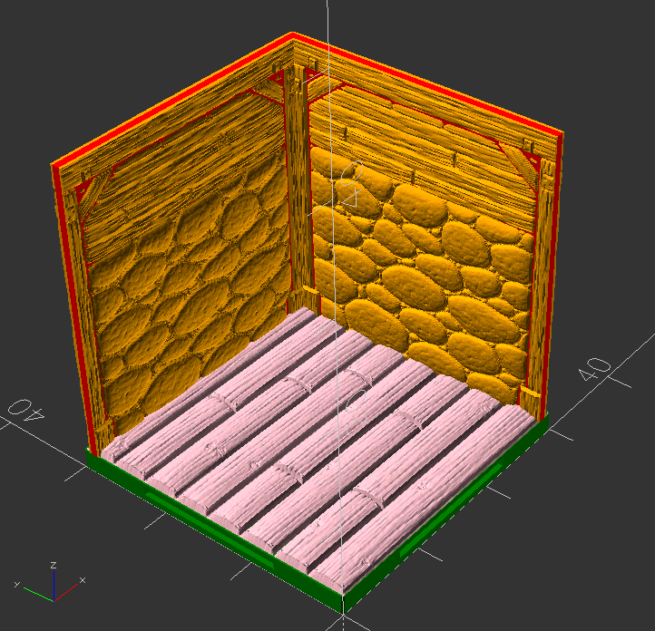

<!-- IMAGES: Replace the two placeholders above with:

-->

I supplied intent and judgment. AI supplied speed and syntax. The printer supplied truth.

<!--
First explain OpenSCAD in plain language:
- It creates 3D geometry from text-based code.
- Modules describe reusable parts; parameters control dimensions and behavior.
- Change a number, render again, and the model updates predictably.

Then explain why it became an effective human–machine interface:
- You defined the goal, constraints, taste, and what "good" felt like.
- AI could read and generate the same textual design language.
- You reviewed the logic and chose what was worth printing.
- The print returned evidence neither human nor AI could simulate perfectly:
  fit, strength, finish, friction, and feel.

The compelling point is not simply that AI wrote OpenSCAD. OpenSCAD gave the
human and AI a shared, editable representation of the product. (~2.5 min)
-->

---

# Version one was… a version

  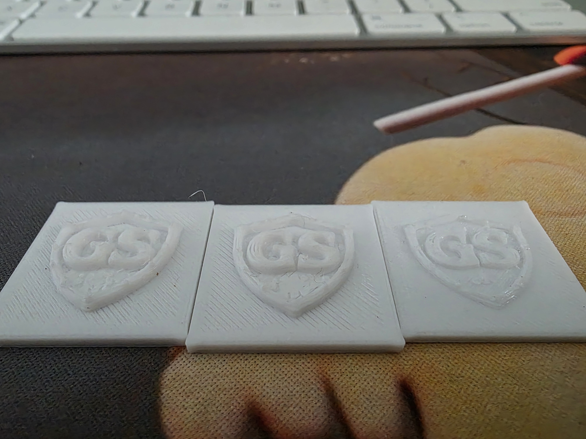

Not impressive.

But it proved the idea could become an object.

<!-- IMAGE: Replace the first placeholder above with:

-->

<!--
Show the genuinely rough beginning. Explain what was wrong: fit, scale, print
time, strength, appearance, or all of the above. (~1 min)
-->

---

# The loop crossed two worlds

1Describe
<b>→</b>

2Generate
<b>→</b>

3Print
<b>→</b>

4Learn

Then feed reality back into the next conversation.

<!--
Give one concrete connector or tolerance example. AI proposed geometry, you
printed it, reality exposed a constraint, and the loop repeated. (~2 min)
-->

---

# The prompt was never the product

  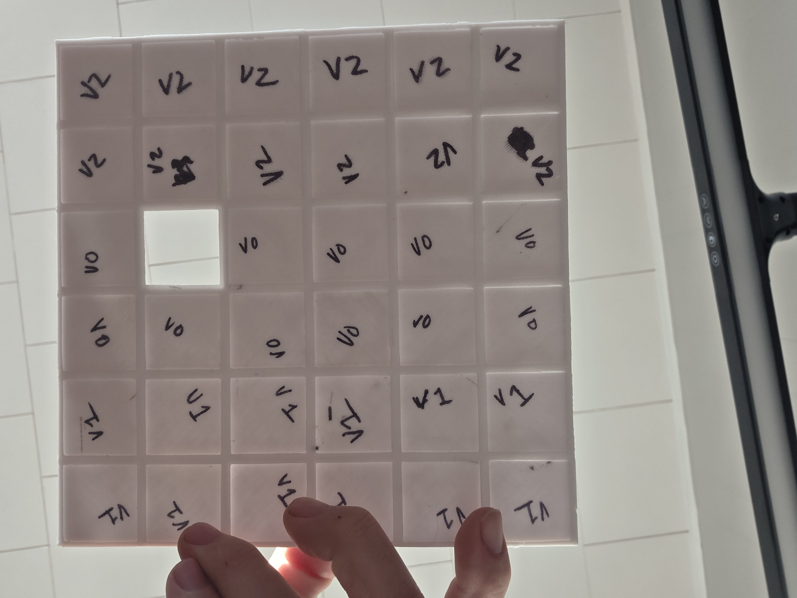

The print was the test.

Plastic settled every argument about fit, strength, and feel.

<!-- IMAGE: Replace the first placeholder above with:

-->

<!--
Contrast vibe coding software with vibe coding a physical product. Generated
code can look right and still print badly. Share a memorable example. (~1.5 min)
-->

---

<!-- _class: photo -->

# Print. Wait. Fail. Repeat.

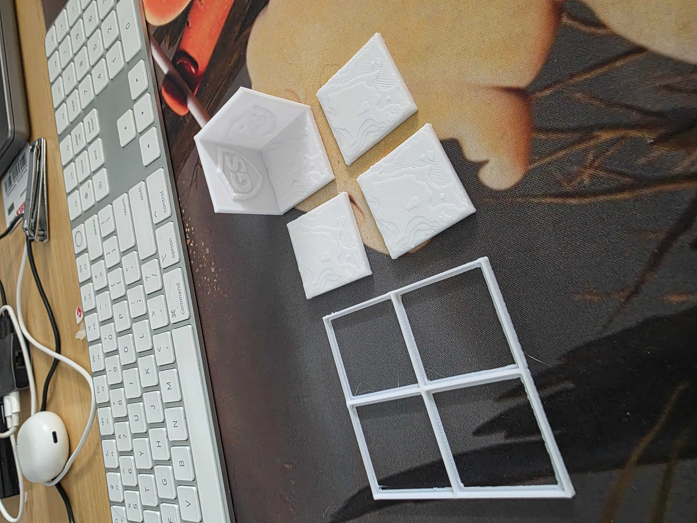
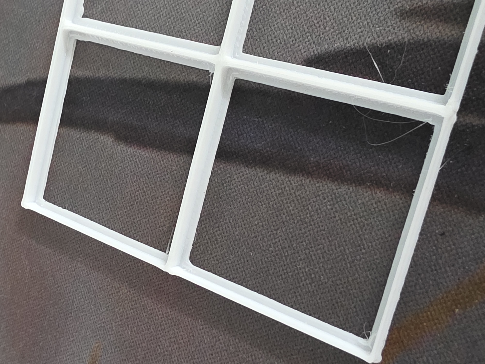
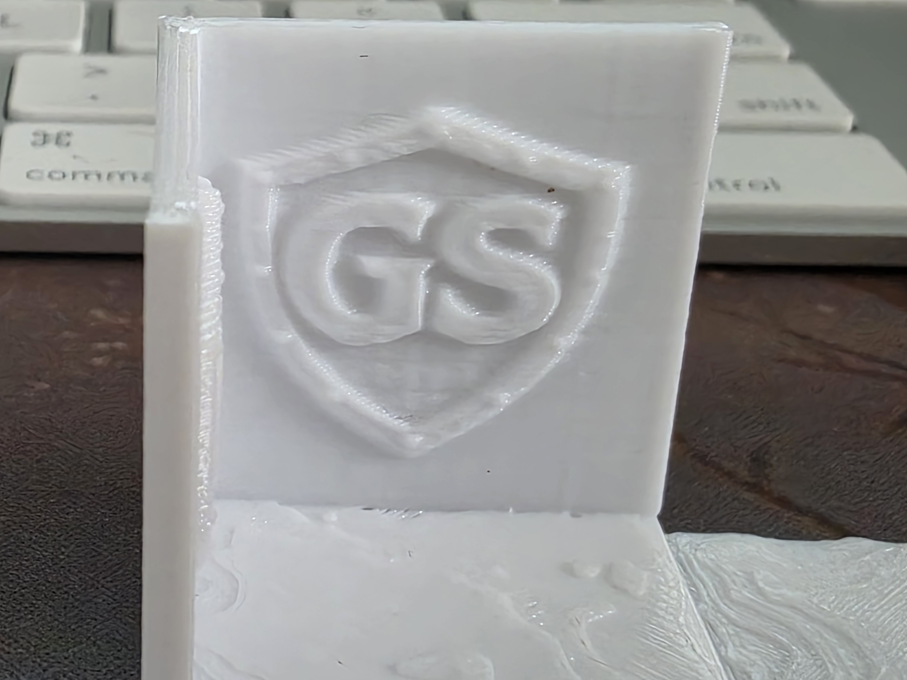
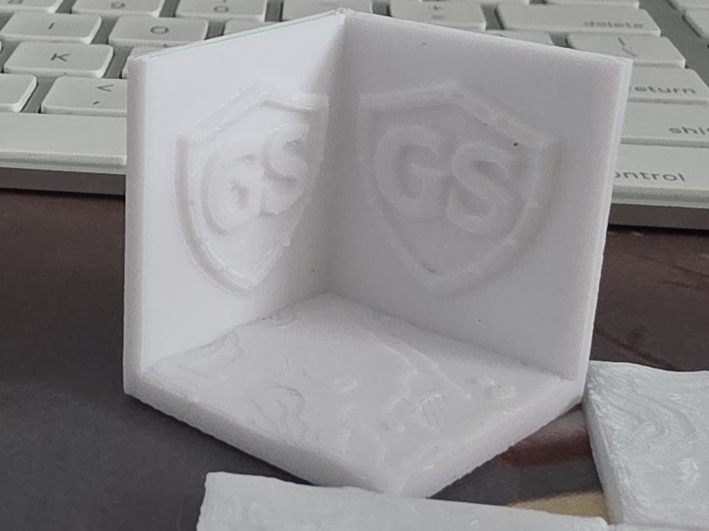

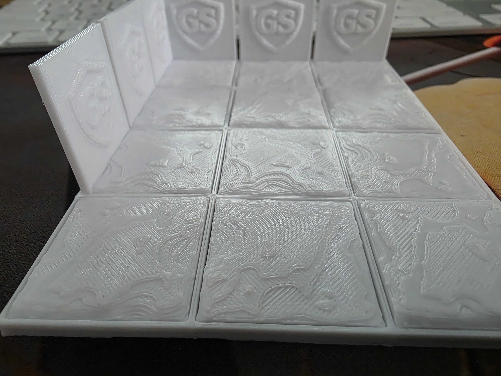
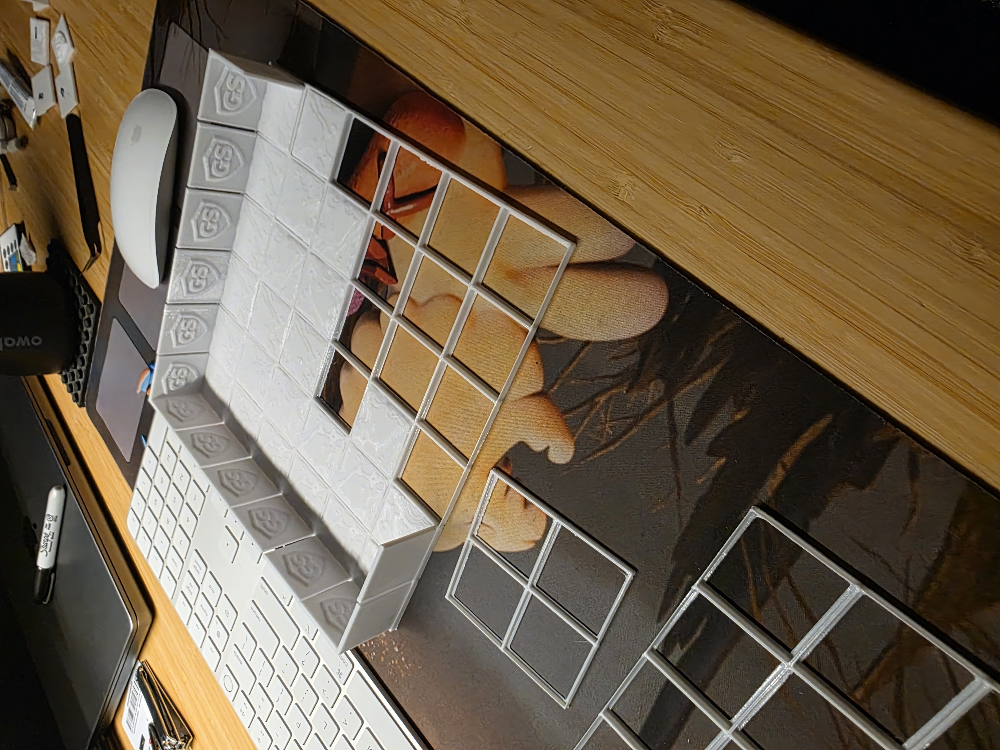
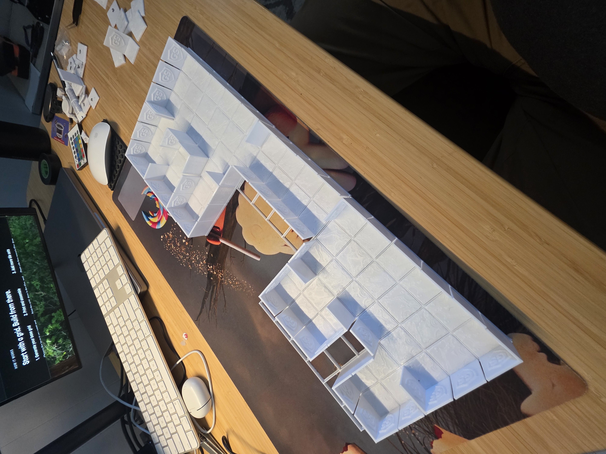

<!--
Tell two short failure stories. Each failure purchased information: name the
assumption it disproved and the change it caused. (~1.5 min)
-->

---

# Millimeters became product decisions

0.1 mm
Too tight

0.2 mm
Promising

0.3 mm
Too loose

Placeholder values—replace with a real tolerance experiment.

<!-- OPTIONAL IMAGE: Replace the comparison above with:

-->

<!--
Replace these numbers with a real example. Discuss tolerances, elephant's foot,
layer lines, material behavior, or calibration. (~1.5 min)
-->

---

# The slicer is where design meets reality

  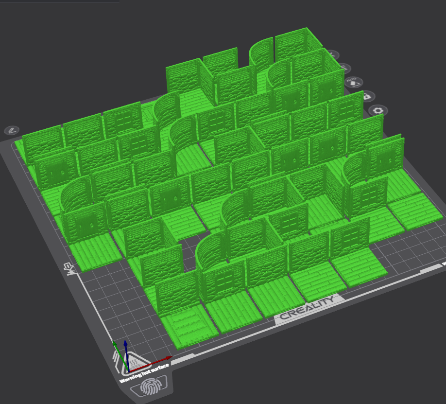

  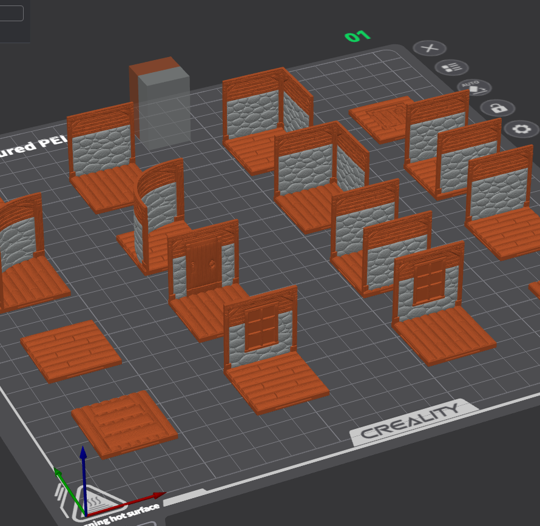

<!-- IMAGES: Replace the two placeholders above with:

-->

<!--
Define a slicer in one sentence. Explain how orientation changes strength and
finish, supports cost time, and small changes compound across a batch. (~1.5 min)
-->

---

<!-- _class: photo -->

# One prototype became a tiny factory

  

<!-- IMAGE: Replace the placeholder above with:

-->

<!--
Cover the printer evolution, K2 + CFS, print hours, filament, consistency,
batching, machine babysitting, packaging, and inventory. (~2 min)
-->

---

# Software bugs can be patched

A bad print wastes <strong>hours.</strong>

A bad batch wastes <strong>a weekend.</strong>

<!--
Let the contrast land. Explain how matter encouraged smaller tests, deliberate
validation, repeatability, and respect for production constraints. (~1 min)
-->

---

<!-- _class: statement -->

# At some point, the project needed a name

## Grid + craft + system → **GridSmith**

<!--
Tell the naming story if there is one. This is the pivot from experiment to
product: branding, packaging, instructions, and someone else using it. (~1 min)
-->

---

# The physical product needed a digital home

  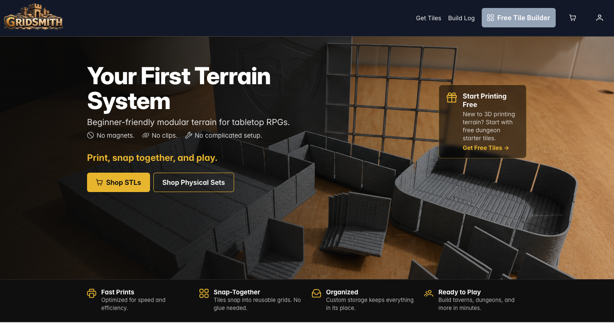

<!-- IMAGE: Replace the placeholder above with:

-->

<!--
The website became a second product, not just checkout. What did it need to
explain that was obvious when holding the pieces? (~1 min)
-->

---

# I wanted tools—not just pages

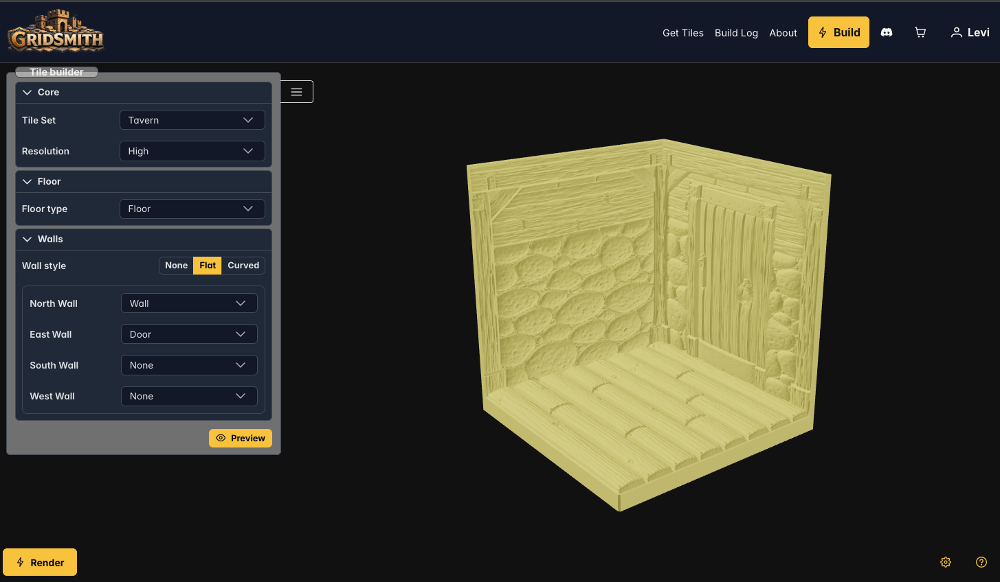

<strong>Tile Builder</strong>
Design a tile, preview the geometry, and export the STL—all in the browser.

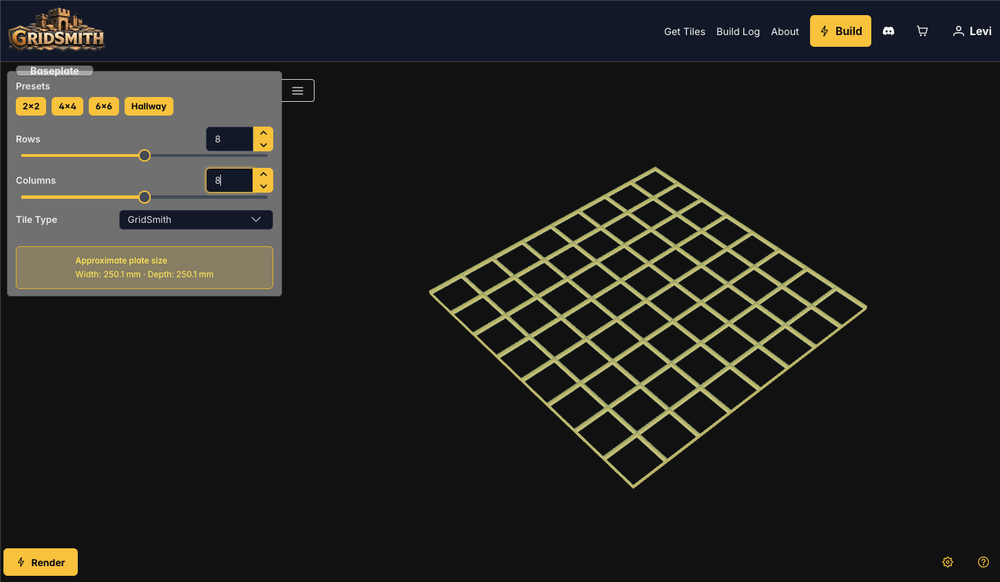

<strong>Grid Builder</strong>
Plan the playable space before committing hours and filament to a print.

<!--
Frame these as capabilities you wanted to exist, not requirements handed to
you by a product manager.

Tile Builder:
- Let someone shape a useful part without learning OpenSCAD.
- Run OpenSCAD through WASM locally in the browser.
- Preview and export the STL without sending CAD work to a server.
- Turn the parametric system you built for yourself into a tool other people
  could use.

Grid Builder:
- Planning should happen before printing.
- Help people reason about rooms, coverage, and the pieces they actually need.
- Reduce wasted filament and abandoned prints by moving experimentation into
  the browser.

The larger idea: the website began reflecting the same GridSmith principle as
the physical product—remove friction between an idea and play. (~2 min)
-->

---

# I wanted buying terrain to feel just as direct

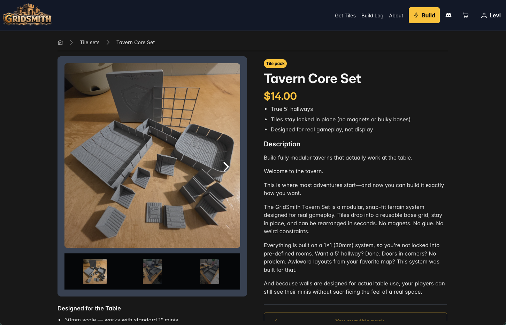

<strong>Discover.</strong> Choose. Own. Download—or order the physical set.

<!--
Explain the shopping experience you wanted:
- One place for physical sets, printable tile packs, and tools.
- A catalog that makes the system understandable rather than exposing a pile
  of disconnected files.
- Stripe Checkout for the transaction.
- Cognito-backed ownership so the site knows which packs a customer owns.
- Private S3 files delivered through presigned download URLs.

This is where the four-system architecture becomes a user experience:
Vercel presents the shop, Cognito knows the customer, Stripe records the
purchase, and AWS grants access to the files.

Keep the focus on the experience you wanted to create; the implementation is
evidence that you could build it. (~1.5 min)
-->

---

# The website is really four systems

<strong>Vercel</strong>Website + builders

<strong>AWS</strong>Commerce API + tile pack files

<strong>Stripe</strong>Money + catalog

<strong>Cognito</strong>Who you are

<strong>In the browser:</strong> React 18 + TypeScript · PrimeReact · OpenSCAD WASM · MDX

<strong>Shipping it:</strong> Webpack · GitHub Actions · Node 24

<!--
Start with the mental model; it makes the implementation easier to follow:
- Vercel is the website and the interactive builders.
- AWS is the authenticated commerce API and protected pack files.
- Stripe owns money, prices, Checkout, receipts, and the product catalog.
- Cognito answers who the user is.

Frontend / app:
- React 18 single-page app written in TypeScript and bundled with Webpack.
- PrimeReact, PrimeFlex, and PrimeIcons provide the UI system.
- Marketing pages, shop, and builders all live in the same client app.
- OpenSCAD runs as WASM in the browser. Baseplate and tile builders can preview
  models and export STL files without server-side CAD.
- Build-log posts are MDX compiled into the application bundle with
  @mdx-js/loader and @mdx-js/react.

Hosting:
- Vercel serves the static SPA from `npm run build:all`.
- Environment variables provide Cognito configuration and
  GRIDSMITH_API_BASE_URL.
- The blog build generates a sitemap and can optionally prerender `/blog`
  routes after the main build.

Identity:
- Amazon Cognito Hosted UI supports authentication, including Google.
- The browser holds the ID token.
- The Cognito pool and client must match the configuration verified by the API
  Lambdas.

Commerce / API:
- API Gateway and Lambda are defined with SAM under `infra/api`.
- Separate dev, staging, and production stages.
- Stripe credentials come from Secrets Manager through STRIPE_SECRET_ARN.
- Core endpoints cover catalog, Checkout sessions, owned-pack capabilities,
  and presigned tile-pack download URLs.
- Each stage has a private S3 bucket for purchased files; downloads use
  presigned GET URLs.

Delivery and testing:
- GitHub Actions can deploy through OIDC to IAM; local
  `npm run deploy:api:*` commands are also available.
- CI runs test/build workflows separately from API deployment.
- The toolchain is Node 24 with Jest and Puppeteer end-to-end coverage,
  although e2e is often skipped in CI for now.

This is a tour of responsibilities, not a request for the audience to memorize
the stack. The surprising detail worth lingering on is OpenSCAD WASM: the
browser is performing real CAD work locally. (~2.5–3 min)
-->

---

<!-- _class: statement dark -->

# Vibe coding the website

## Let’s open Cursor.

<!--
Leave the deck and open the GridSmith project in Cursor.

Show one end-to-end website story:
- The intent or problem you described
- How Cursor explored the existing codebase
- The proposed or generated change
- The browser result
- What still required your judgment

Keep the live portion bounded. The goal is to show the collaboration loop, not
to complete a risky feature in front of the audience. (~3–4 min)
-->

---

# The website had its own sharp edges

Product photography

Image performance

Explaining the system

SEO & discovery

Content automation

<!--
Choose 2–3 strong stories: images without slow pages; explaining a tactile
system; reusable content; deployment; or reviewing plausible AI output. (~1.5 min)
-->

---

# What surprised me most

<strong>AI amplified engineering.</strong> It did not remove the need for it.

<strong>Iteration beat expertise.</strong> Momentum made the unfamiliar learnable.

<strong>Physical feedback changed everything.</strong> Reality was always in the loop.

<!--
Keep this reflective and personal. Rewrite anything that is not authentic to
your experience. (~2 min)
-->

---

<!-- _class: statement dark -->

# One developer became a small product team

## CAD modeler · manufacturing engineer · web developer · writer · photographer · marketer

<!--
The point isn't mastery of every discipline. AI lowered the activation energy
enough to participate in all of them and keep moving. (~1 min)
-->

---

# What’s next on the workbench?

More environments

Print Planner

Better production workflows

More automation

<!-- IMAGE: Replace the placeholder above with:

-->

<!--
Only mention work you genuinely expect to pursue. Explain Print Planner in one
sentence and save a demo for Q&A. (~1 min)
-->

---

<!-- _class: closing -->
<!-- _paginate: false -->
<!-- _footer: "" -->

# AI lowered the barrier.

## Iteration built the product.

### And now there’s a real thing on the table.

<!--
Return to the physical object and click a tile into place.
"The exciting part isn't that AI built GridSmith for me. It's that AI lowered
the barrier enough that I finally built the thing I'd been thinking about."
Invite questions. (~1 min)
-->

---

<!-- _class: feedback -->

# Help me sharpen the next version

01
<strong>Is this talk good enough for the AI User Group?</strong>

02
<strong>What is missing—or what could I elaborate on?</strong>

<!--
Open the floor for candid feedback rather than general Q&A.

First question:
"Do you think this is strong enough—and useful enough—for the AI User Group?"

Second question:
"What felt missing, rushed, or worth going deeper on?"

Listen especially for:
- Places where the story assumes too much technical knowledge
- Moments where a real example would be stronger than a summary
- Questions about the human/AI working relationship
- Which live or physical demonstrations created the most value

Capture the feedback after the session so this lunch & learn becomes the first
iteration of the user-group talk. (~3–5 min)
-->

---

<!-- _class: thank-you -->
<!-- _paginate: false -->
<!-- _footer: "" -->

# Thank you

## gridsmith.io

<!--
End here after the feedback discussion.

Thank everyone for their time, for handling the samples, and for helping you
improve the next version of the talk.
-->
